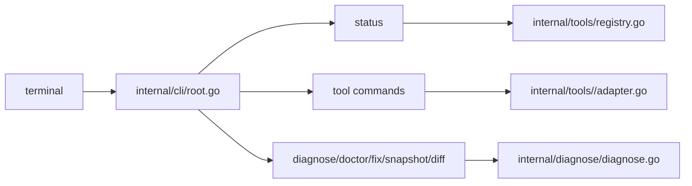

# CLI

Active contributors: oldwinter, chendongdong

## Purpose

The CLI is the only runtime application in the repo. It exposes status inventory, focused tool context commands, diagnostics, dry-run fixes, snapshots, diffs, completion, version, options, and a hidden surprise command.

## Directory layout

```text
cmd/all-cli/main.go        process entrypoint
internal/cli/root.go       root command, flags, groups, command registration
internal/cli/status.go     broad inventory command
internal/cli/*go           focused tool and utility commands
```

## Key source files

| File | Purpose |
| --- | --- |
| `cmd/all-cli/main.go` | Calls `cli.NewRootCommand()` and exits non-zero on command error. |
| `internal/cli/root.go` | Creates the Cobra root command, global flags, command groups, and subcommands. |
| `internal/cli/status.go` | Implements `status` flags, filtering, concurrent evaluation, sorting, and output choice. |
| `internal/cli/agent_commands.go` | Implements `diagnose`, `doctor`, `fix`, `snapshot`, and `diff`. |
| `internal/cli/kubectl.go` | Example of a rich per-tool command tree with status/current/list/use/namespace. |
| `internal/cli/surprise.go` | Hidden easter-egg command. |

## Key abstractions

| Abstraction | File | Description |
| --- | --- | --- |
| `NewRootCommand` | `internal/cli/root.go` | Builds the top-level Cobra command and registers all subcommands. |
| `rootOptions` | `internal/cli/root.go` | Stores global `--json` and `--timeout` state shared by commands. |
| `buildStatusReport` | `internal/cli/status.go` | Evaluates the registry and returns a `model.StatusReport`. |
| `runSingleToolStatusCommand` | `internal/cli/cloud_helpers.go` | Reuses status rendering for one tool. |
| `model.UseResult` | `internal/model/model.go` | Stable JSON output for context-switching commands. |

## How it works



The root command sets global flags and validates that `--timeout` is positive. Status commands evaluate selected registry tools. Focused tool commands call adapters directly when they need list or use operations. Agent commands reuse status reports and pass them to diagnostic or diff logic.

## Integration points

The CLI integrates with [tool registry and evaluation](../systems/tool-registry-and-evaluation.md), [tool adapters](../systems/tool-adapters.md), [diagnostics and snapshots](../systems/diagnostics-and-snapshots.md), and [output rendering](../systems/output-rendering.md).

## Entry points for modification

Add new command trees in `internal/cli/`, register them from `internal/cli/root.go`, and keep external command details in adapters under `internal/tools/`.
