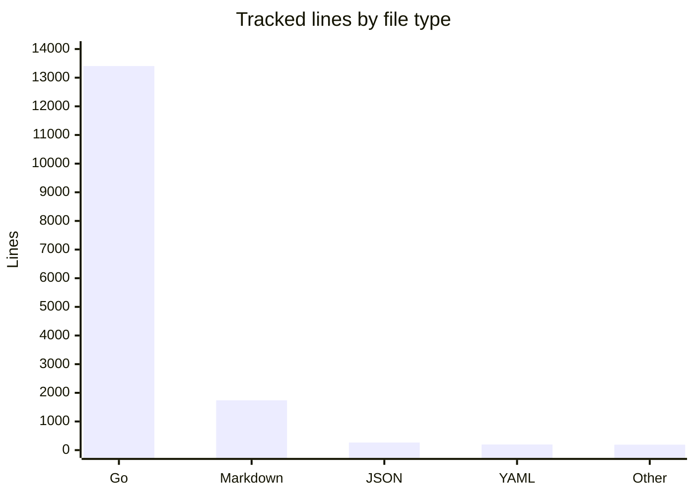

# By the numbers

Data collected on 2026-05-05 from local git history and tracked files.

## Size

| Metric | Value |
| --- | ---: |
| Tracked files, excluding `dist/` | 120 |
| Go files | 97 |
| Non-test Go files | 48 |
| Go test files | 49 |
| Markdown files | 13 |
| JSON schema files | 2 |
| Go packages | 22 |
| Tracked lines | 15,795 |
| Go lines | 13,407 |

The code has slightly more test files than non-test Go files. The biggest non-test source file is `internal/tools/registry.go`, which is also the central inventory list.

## Activity

Local history contains 45 commits from 2026-02-24 through 2026-05-02. Recent 90-day activity by week:

| Week | Commits |
| --- | ---: |
| 2026-W09 | 5 |
| 2026-W10 | 3 |
| 2026-W11 | 12 |
| 2026-W12 | 15 |
| 2026-W14 | 8 |
| 2026-W18 | 2 |

High-churn files in the last 90 days:

| File | Changes in git log |
| --- | ---: |
| `README.md` | 14 |
| `internal/tools/registry.go` | 14 |
| `internal/cli/root.go` | 11 |
| `internal/cli/status.go` | 11 |
| `internal/tools/evaluate.go` | 5 |
| `.github/workflows/ci.yml` | 5 |
| `internal/tools/aws/adapter.go` | 5 |
| `justfile` | 5 |

## Bot-attributed commits

| Metric | Value |
| --- | ---: |
| Commits with bot co-authorship markers | 0 / 45 |
| Commit messages mentioning common bot accounts | 0 / 45 |

This is a lower bound for automated or AI-assisted work. Inline coding assistants leave no reliable trace in git history. Release automation itself is configured in `.github/workflows/release.yml` and `.goreleaser.yaml`, but the local commit messages do not carry bot co-author trailers.

## Complexity snapshot

| Metric | Value |
| --- | ---: |
| Built-in registry tools | 45 |
| Tool categories | 15 |
| Adapter packages | 15 |
| Tools with current-context style data | 14 |
| Tools switchable through `all-cli` | 7 |
| Exported symbols in `internal/model` | 24 |
| Exported symbols in `internal/tools` root package | 6 |
| Exported symbols in `internal/diagnose` | 5 |

Largest tracked files:

| File | Lines | Role |
| --- | ---: | --- |
| `internal/cli/kubectl_cli_test.go` | 524 | kubectl command tests |
| `internal/tools/registry.go` | 506 | built-in tool registry |
| `internal/cli/argocd_cli_test.go` | 476 | Argo CD command tests |
| `internal/cli/docker_cli_test.go` | 416 | Docker command tests |
| `internal/diagnose/diagnose.go` | 395 | diagnostics and snapshot diff rules |

The import chain is shallow: `cmd/all-cli/main.go` imports `internal/cli`, command handlers import `internal/tools`, `internal/diagnose`, `internal/output`, `internal/execx`, and those packages meet at `internal/model`. For cleanup ideas based on these hotspots, see [cleanup opportunities](cleanup-opportunities.md).
