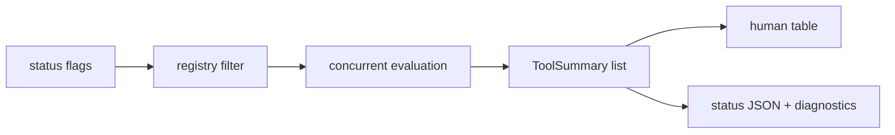

# Status inventory

Active contributors: oldwinter, chendongdong

## Purpose

`all-cli status` gives a broad inventory view across local CLIs. It reports installation, configuration state, capabilities, current context-like state, warnings, errors, and metadata for agent callers.

## Key source files

| File | Purpose |
| --- | --- |
| `internal/cli/status.go` | Cobra command, flags, filtering, sorting, concurrent registry evaluation. |
| `internal/tools/registry.go` | Built-in tool registry and lookup. |
| `internal/tools/evaluate.go` | Per-tool evaluation logic. |
| `internal/tools/metadata.go` | Per-tool purpose, configured semantics, and current field descriptions. |
| `internal/model/model.go` | `StatusReport`, `ToolSummary`, `Capability`, legend, and schema constants. |
| `schemas/status-report-v0.1.json` | Machine-readable status JSON contract. |

## Key abstractions

| Abstraction | File | Description |
| --- | --- | --- |
| `ToolDefinition` | `internal/tools/registry.go` | Declares one tracked CLI. |
| `ToolSummary` | `internal/model/model.go` | Per-tool evaluation result. |
| `StatusReport` | `internal/model/model.go` | Top-level inventory report. |
| `ToolMetadata` | `internal/model/model.go` | Guidance for humans and agents. |

## How it works

`status` starts from the built-in registry, filters IDs from `--tools` when provided, then evaluates selected `ToolDefinition` entries concurrently. Each evaluation resolves binary installation, runs optional configuration and current-state callbacks, and attaches metadata.

Human output defaults to a category-grouped table. JSON output includes the stable `StatusReport` shape and adds diagnostics for agent callers.

## Integration points

The feature uses [tool registry and evaluation](../systems/tool-registry-and-evaluation.md), [tool adapters](../systems/tool-adapters.md), and [output rendering](../systems/output-rendering.md).

## Entry points for modification

Add or remove tracked tools in `internal/tools/registry.go`, add metadata in `internal/tools/metadata.go`, and update the schema in `schemas/status-report-v0.1.json` when JSON fields change.
