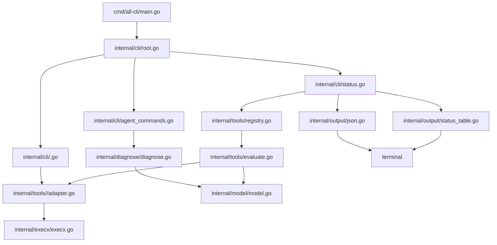
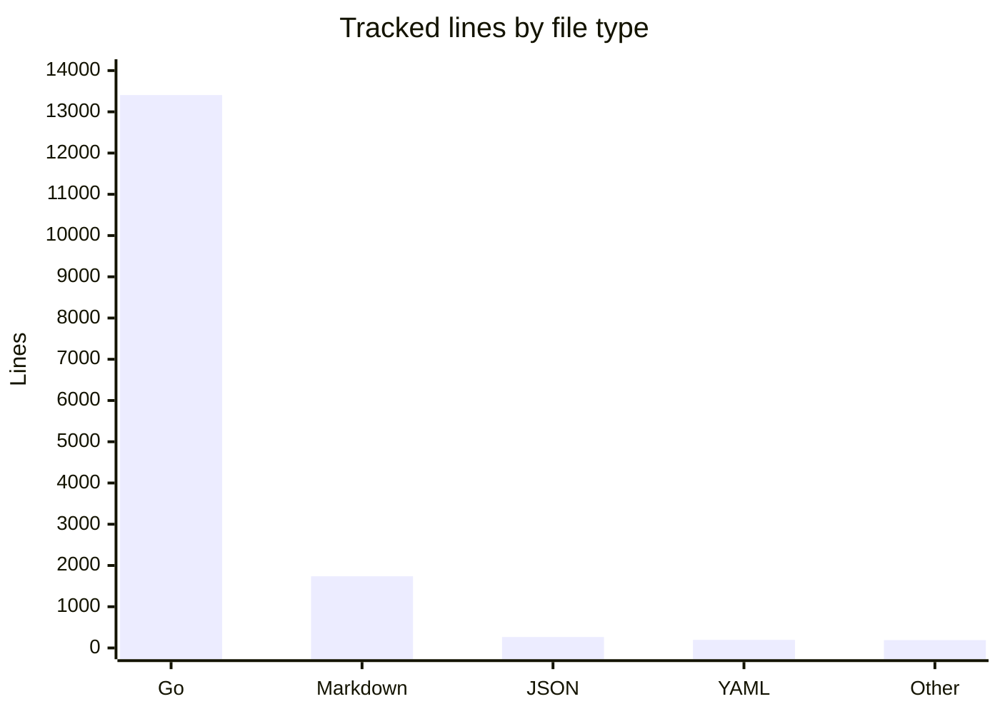

# Architecture

`all-cli` is a single-process Go CLI. Commands collect facts from local executables, normalize them into shared model types, and render either human tables or stable JSON.

## Component map

## Main data flow

1. `cmd/all-cli/main.go` constructs `cli.NewRootCommand()` from `internal/cli/root.go`.
2. Cobra parses global flags such as `--json` and `--timeout` into `rootOptions`.
3. `internal/cli/status.go` chooses registry entries from `internal/tools/registry.go`.
4. Each selected `ToolDefinition` is evaluated by `tools.Evaluate` in `internal/tools/evaluate.go`.
5. `tools.Evaluate` calls `execx.LookPath` for install detection, then calls config/current callbacks backed by adapter packages.
6. Adapter packages run external CLI commands through `execx.Runner` from `internal/execx/execx.go`.
7. Results become `model.ToolSummary` entries in a `model.StatusReport` from `internal/model/model.go`.
8. Human output goes through `internal/output/status_table.go`; JSON output goes through `internal/output/json.go`.

## Package responsibilities

| Directory | Responsibility |
| --- | --- |
| `cmd/all-cli` | Minimal process entrypoint. |
| `internal/cli` | User-facing commands, flags, argument validation, and terminal UX. |
| `internal/tools` | Built-in tool catalog, evaluation, metadata, and adapters. |
| `internal/diagnose` | Diagnostic rules, dry-run fix plans, and snapshot diffs. |
| `internal/model` | Stable report structs shared by commands, schemas, and tests. |
| `internal/output` | Status table and JSON rendering helpers. |
| `internal/execx` | Process execution abstraction, timeout wrapper, and output helpers. |

## Language mix

The implementation is Go-heavy: 97 Go files account for about 13.4k tracked lines. Markdown, JSON schemas, workflow YAML, and release config make up the rest.

## Design boundaries

`all-cli` does not embed provider SDKs. It shells out to official CLIs through `internal/execx/execx.go`, which keeps behavior close to what users already run manually. The adapters avoid plaintext token output and return warnings/errors as structured fields instead of logging directly.

For contributor workflow details, see [patterns and conventions](../how-to-contribute/patterns-and-conventions.md). For runtime dependency details, see [dependencies](../reference/dependencies.md).
